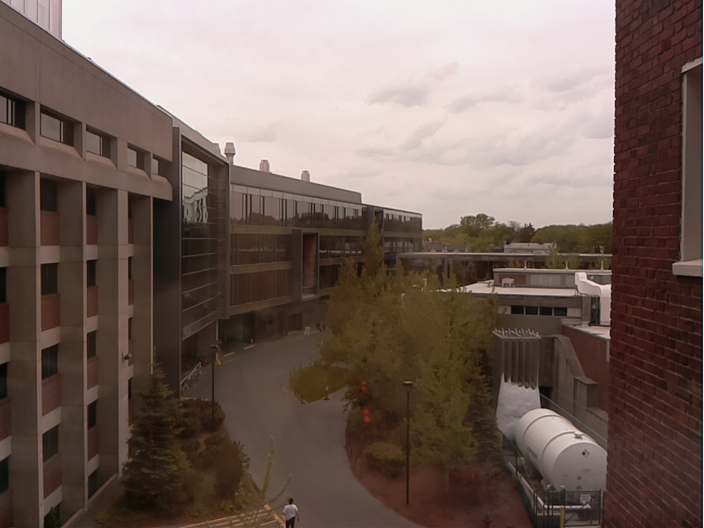
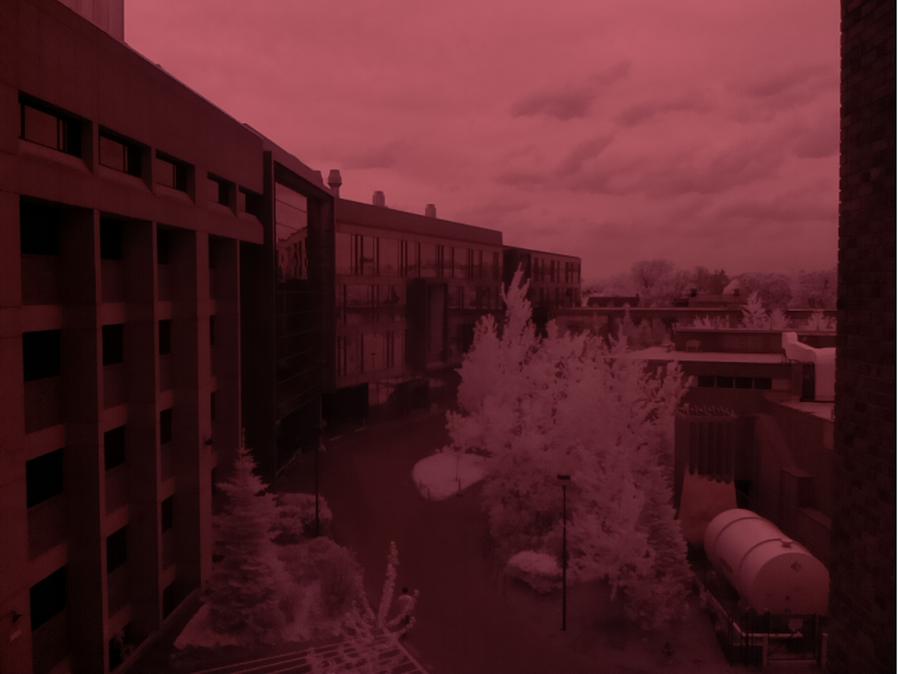
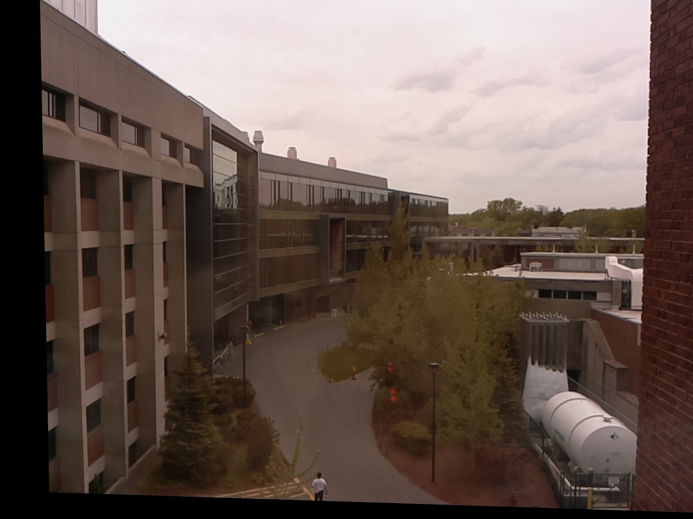
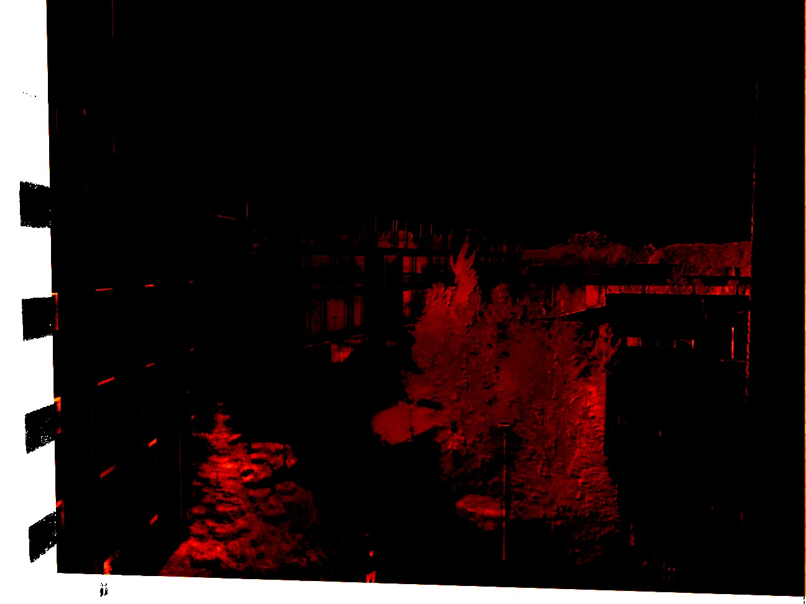

## Introduction

This is a small python script showing three methods to align images using OpenCV or standard python based code. Personally I've used all three techniques in various projects, in particular to align images taken by separate raspberry pi cameras with different spectral responses (i.e. filters).

You can grab the example code as well as two example images from this repo by cloning it using:

```bash
git clone image registration
```

A worked example with the included images is given below.

Required python packages include:

- OpenCV
- numpy

## Methods

The script includes three different methods for calculating image registration / alignment transformation information.

- FFT phase correlation
- Enhanced Correlation Coefficient (ECC) maximization
- Feature based registration

In this list, phase correlation is the simplest method and only calculates the translation (shift) of one image compared to the other. In contrast, the ECC methodology can compensate for both shifts, shifts + rotations (euclidean), shifts + rotation + shear (affine), or [homographic](https://en.wikipedia.org/wiki/Homography_(computer_vision)) (3D) transformations of one image to the next. The feature based methodology uses a homographic representation but uses features within the image rather than a correlation based method on the whole image to search for these values.

Depending on the question at hand selecting the methodolgy which most closely matches the deformation between two images will yield the best (and fastest) results. For example, in a past project images were offset along the x axis only. In this case, a phase correlation method was preferred.

## Worked example

To show the functions of the script I've included two example images, `rgb_image.jpg` and `nir_image.jpg`. These two images were taken using a raspberry pi and two seperate cameras hooked up to a multiplexer to acquire them in rapid succession. The RGB image is a standard colour image, while the other image is a near-infrared (NIR) image taken with raspberry pi NO-IR camera combined with a red-edge filter. Both cameras were physically offset. To align both of the images and fuse the data a correction needs to be made.

|  RGB | NIR  | 
|---|---|
|   |   |

The default settings on the script will call the feature based alignment method and align both images. The aligned image (image 1) will be written to disk as a new image, `reg_image.jpg`.

```bash
./align_images.py -im1 rgb_image.jpg -im2 nir_image.jpg -m feature
```

This routine will calculate and output an aligned image and print the transformation matrix to the console. For phase correlation only the offsets (x,y) are returned, no corrected image is provided.

```bash
[[ 9.28381660e-01  2.04421105e-02  7.46501803e+01]
 [-3.16804178e-02  9.76211344e-01 -3.10401493e+00]
 [-6.64593229e-05  2.67611823e-05  1.00000000e+00]]

```

|  RGB | NIR  | 
|---|---|
|   |   |

In this example the final goal was to combine the spectral information of both images into a [vegetation index](https://en.wikipedia.org/wiki/Vegetation_Index). The below image combines the red band of the aligned RGB image with the (red) NIR band into an [NDVI index](https://en.wikipedia.org/wiki/Normalized_difference_vegetation_index). The red colours below show high vegetation densities, corresponding to the trees and grass patches in the image (or their reflections).



## Other settings

The above example uses the feature based method. However, in this example the ECC based methodology worked less well. When using this code you will have to play with the parameters and various methodologies to come to an optimal solution.

For a full list of options use:

```bash
./align_images.py -h
```
